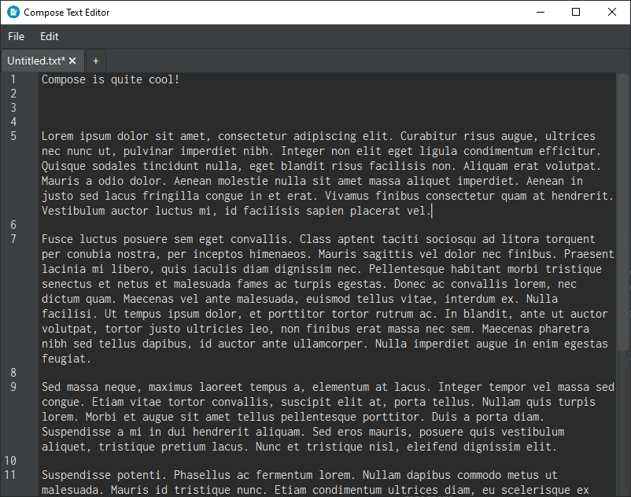
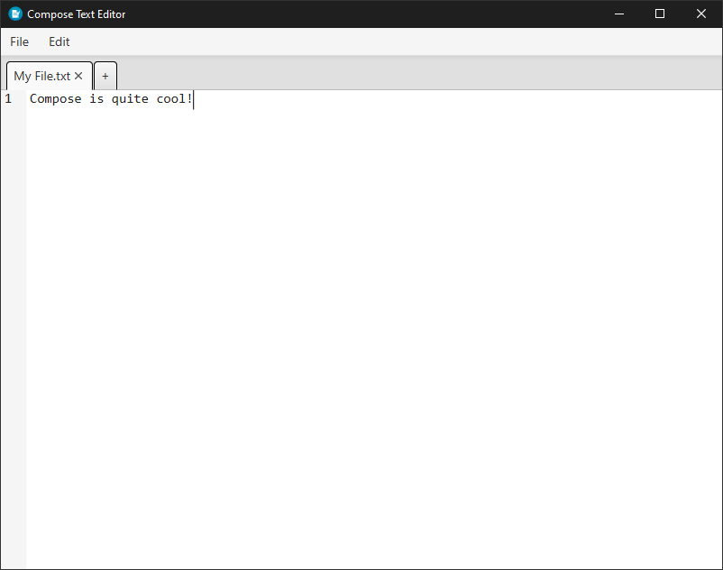
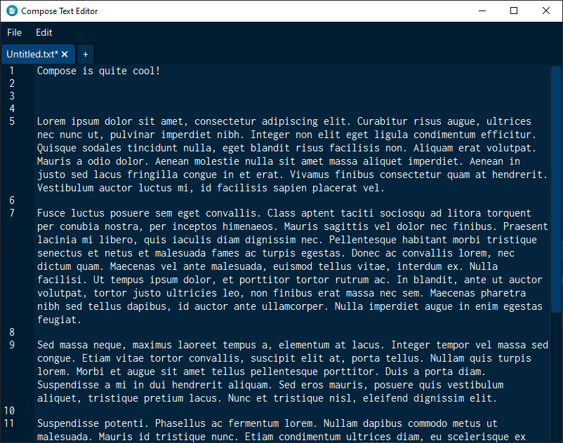
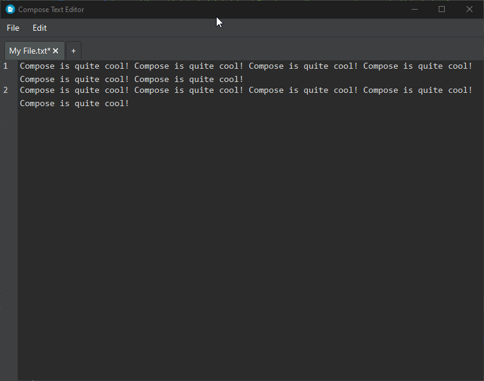

<div align="center">

# Compose


### Because Notepad wasn't enough.

[![Windows Build Status][Windows-Build-SVG]][Windows-Build-Action]
[![Ubuntu Build Status][Ubuntu-Build-SVG]][Ubuntu-Build-Action]
[![Mac OS Build Status][MacOS-Build-SVG]][MacOS-Build-Action]

**[Download][Download Link] • [Changelog][Changelog link]**

</div>

## About Compose
Compose is a text editor written in Java, specifically [JavaFX][JavaFX-Link]. It serves as a text editor to help you keep your note-taking in check.

## Highlights

### Pleasant Theming
With color appeal on the rise, Compose came prepared with themes -- more are on the way!

#### Darc Theme
Dark theme enthusiasts, rejoice!


#### Light Theme
Light theme users, rejoice!


#### Fresh Theme
Want something fresh and out there? You can rejoice too!


### Configurable Settings
Easily change the text wrap, font, font size, and theme -- Compose auto-magically saves your settings for you to come back later.


## Building the Source Code
1. If you don't already have it, download [Git][Git-Link]. It's a powerful source control tool, and is the same source control that Compose uses.
    
- You don't need to have Gradle installed to build Compose -- Gradle projects come with the build tool specialized for the project already.
    
2. Using Git, clone the Compose repository.
    ```bash
    git clone https://github.com/lucasstarsz/Compose.git
    ```

3. Once you've entered the top directory of the project (`cd Compose`), build the project using the `gradlew` file.
    - On Windows, you'll want to use the `gradlew.bat` file.
    - On Unix-based systems (macOS, Linux), you'll need to use the `gradlew.sh` file (after giving it proper execution permissions).
    ```bash
    ./gradlew build
    ```
_Having trouble accessing the `gradlew` file? Read [this][Terminals Are Different]._

## Legal Information
This repository is licensed under the [MIT License][MIT-License].


[Windows-Build-Action]: https://github.com/lucasstarsz/Compose/actions?query=workflow%3ABuild-Windows "Windows Build Status"
[Windows-Build-SVG]: https://img.shields.io/github/workflow/status/lucasstarsz/Compose/Build-Windows?label=Windows%20Build&labelColor=363e45&logo=windows&logoColor=0078D6&style=for-the-badge

[Ubuntu-Build-Action]: https://github.com/lucasstarsz/Compose/actions?query=workflow%3ABuild-Ubuntu "Ubuntu Build Status"
[Ubuntu-Build-SVG]: https://img.shields.io/github/workflow/status/lucasstarsz/Compose/Build-Ubuntu?label=Ubuntu%20Build&labelColor=363e45&logo=ubuntu&logoColor=E95420&style=for-the-badge

[MacOS-Build-Action]: https://github.com/lucasstarsz/Compose/actions?query=workflow%3ABuild-MacOS "Mac OS Build Status"
[MacOS-Build-SVG]: https://img.shields.io/github/workflow/status/lucasstarsz/Compose/Build-MacOS?label=Mac%20OS%20Build&labelColor=363e45&logo=apple&logoColor=000000&style=for-the-badge

[Download Link]: https://github.com/lucasstarsz/Compose/releases "Downloads"
[Changelog Link]: https://github.com/lucasstarsz/Compose/releases/tree/main/changelog.md "Changelog"

[JavaFX-Link]: https://openjfx.io "JavaFX"
[Terminals Are Different]: https://gist.github.com/lucasstarsz/9bbc306f8655b916367d557043e498ad "Terminals Access Files Differently"
[MIT-License]: LICENSE.txt "MIT License"
